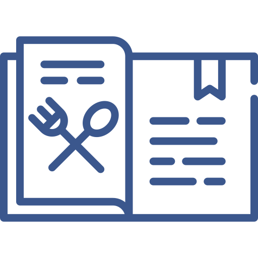

<a name="readme-top"></a>

<div align="center">
  
  <br/>

  <h3><b>Recipe App</b></h3>

</div>

<!-- TABLE OF CONTENTS -->

# 📗 Table of Contents

- [📖 About the Project](#about-project)
  - [🛠 Built With](#built-with)
    - [Tech Stack](#tech-stack)
    - [Key Features](#key-features)
- [💻 Getting Started](#getting-started)
  - [Setup](#setup)
  - [Prerequisites](#prerequisites)
  - [Usage](#usage)
- [👥 Authors](#authors)
- [🔭 Future Features](#future-features)
- [🤝 Contributing](#contributing)
- [⭐️ Show your support](#support)
- [🙏 Acknowledgements](#acknowledgements)
- [📝 License](#license)

# 📖 The Recipe App <a name="about-project"></a>

With the **Recipe App**, you can easily manage your recipes, ingredients, and pantry. It enables you to save ingredients, monitor your stock, devise new recipes, and generate a shopping list based on what you need to complete a recipe. The app recognizes the significance of sharing recipes and therefore lets you make them public for everyone to access.

## 🛠 Built With <a name="built-with"></a>

### Tech Stack <a name="tech-stack"></a>

This project was implemented using:

<details>
  <summary>Client</summary>
  <ul>
    <li><a href="https://reactjs.org/">React.js</a></li>
  </ul>
</details>

<details>
  <summary>Server</summary>
  <ul>
    <li><a href="https://rubyonrails.org/">Ruby on Rails</a></li>
  </ul>
</details>

<details>
<summary>Database</summary>
  <ul>
    <li><a href="https://www.postgresql.org/">PostgreSQL</a></li>
  </ul>
</details>

### Key Features <a name="key-features"></a>

- **Can persist recipe data to database**
- **Can persist stock ingredients data to database**
- **Can create new recipes and generate a shopping list**

<p align="right">(<a href="#readme-top">back to top</a>)</p>

## 💻 Getting Started <a name="getting-started"></a>

To get a local copy up and running, follow these steps:

### Prerequisites

In order to run this project you need to have installed:

- [ ] You’ll need to have Ruby and Rails on your machine.

Optionally, in order to modify this project you should to have installed:

- [ ] Git.

- [ ] Code editor like: [Visual Studio code](https://code.visualstudio.com/), or others...

### Setup

To clone this repository to your desired folder:

- You can download the **Zip** file from the GitHub repository, or clone the repository with:

```console
git clone https://github.com/HunterX-7/Recipe-App.git
```

- Access the cloned directory with:

```console
cd Recipe-App
```

- Open it with your favorite code editor or with the live server

### Usage

It is require that you setup your database to run this project, check the config/database.yml and make sure that the username and password match you postgresql setup, then run:

```console
rails db:create
```

```console
rails db:migrate
```

To run the project, execute the following command in the project directory:

```console
rails server
```

To run test, execute the following commands in the project directory.

To run the unit tests:

  ```console
  rspec ./spec/models 
  ```
To run the integration tests:

  ```console
  rspec ./spec/views
  ```

<p align="right">(<a href="#readme-top">back to top</a>)</p>


## 👥 Authors <a name="authors"></a>

👤 **Francisco Quintero**

- GitHub: [@HunterX-7](https://github.com/HunterX-7)
- Twitter: [@franquin07](https://twitter.com/franquin07)
- LinkedIn: [Francisco Quintero](https://www.linkedin.com/in/francisco-asis-quintero-cede%C3%B1o/)

👤 **Davian Beroni**

- GitHub: [dadadon](https://github.com/dadadon)
- Twitter: [Davian Beroni](https://twitter.com/davianberoni)
- LinkedIn: [Davian Beroni](https://www.linkedin.com/in/davian-beroni/)

<p align="right">(<a href="#readme-top">back to top</a>)</p>

## 🔭 Future Features <a name="future-features"></a>

We will implement this on the future:

- [ ] **Improve the user interface**
- [ ] **Improve the addition of new recipes**
- [ ] **Improve the shoppin list feature**

<p align="right">(<a href="#readme-top">back to top</a>)</p>

## 🤝 Contributing <a name="contributing"></a>

Contributions, issues, and feature requests are welcome!

Feel free to check the [issues page](https://github.com/HunterX-7/Recipe-App/issues).

<p align="right">(<a href="#readme-top">back to top</a>)</p>

## ⭐️ Show your support <a name="support"></a>

Give a ⭐️ if you like this project!

<p align="right">(<a href="#readme-top">back to top</a>)</p>

## 🙏 Acknowledgments <a name="acknowledgements"></a>

- Hat tip to anyone whose code was used.

<p align="right">(<a href="#readme-top">back to top</a>)</p>

## 📝 License <a name="license"></a>

This project is [MIT](./LICENSE) licensed.

<p align="right">(<a href="#readme-top">back to top</a>)

